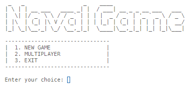
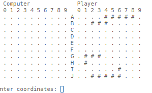

# Naval Game

Simple text-based game that accepts coordinates from player and checks whether there are
any ships on that specific location. 

By default, the Player's ships are shown on the board, while the Computer's aren't. The first
to discover all 3 (three) ships wins the game.

This is my first real project.

 
